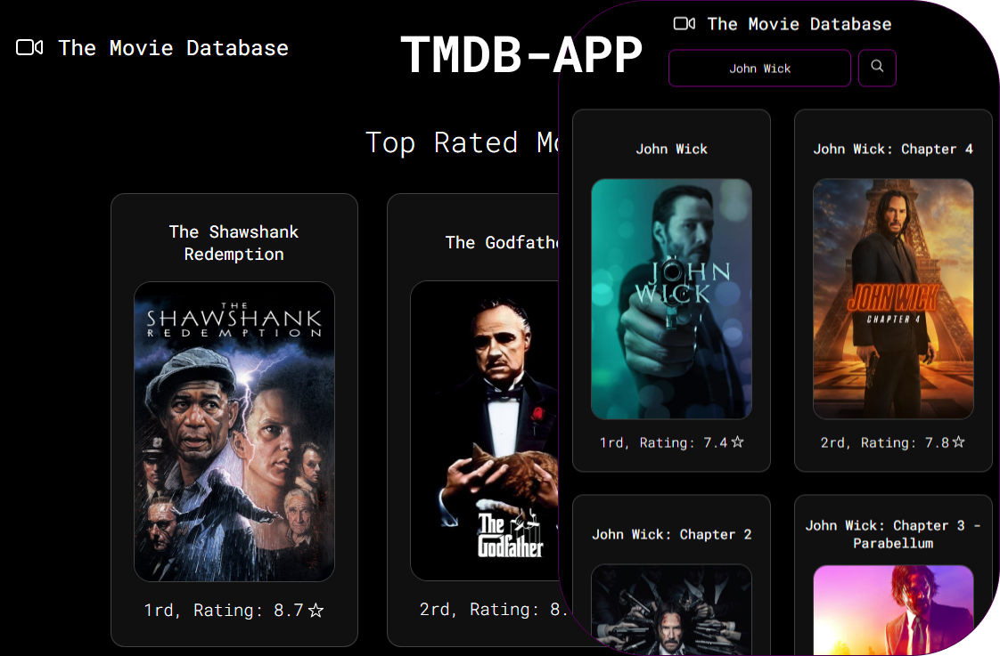

<h1 align="center"> TMDB App </h1>

<p align="center">
  
</p>

<p align="center"> This is a simple project i made using <a href="https://developer.themoviedb.org/docs/getting-started" target="_blank" >TMDB.</a>  <br/>
</p>

<p align="center">
  <a href="#-technologies">Technologies</a>&nbsp;&nbsp;&nbsp;|&nbsp;&nbsp;&nbsp;
  <a href="#-project">Project</a>&nbsp;&nbsp;&nbsp;|&nbsp;&nbsp;&nbsp;
  <a href="#-usage">Usage</a>&nbsp;&nbsp;&nbsp;|&nbsp;&nbsp;&nbsp;
  <a href="#-license">License</a>
</p>

<br>

## 🚀 Technologies

This project was developed using the following technologies:

- HTML
- CSS
- JS

## 💻 Project

### [See how it actually is live]()

## 💾 Installation

<h3 align="center"> Clone this rep :</h3>

```
git clone 
```
<h3 align="center">  Open its folder :</h3>

```
cd 
```
### then, go see the usage to get and implement your api key!

## 🔖 Usage

### Get your [api key at tmdb site](https://developer.themoviedb.org/docs/getting-started), copy the bearer and change it on [script.js](./src/script.js)
```
const options = {
    method: 'GET',
    headers: {
        accept: 'application/json',
        Authorization: 'Bearer CHANGE YOUR BEARER!' <<< change it!
    }
};
```
### now, feel free to implement your desired functionalities!
## 📖 License
### This project uses the [MIT License](/MIT-LICENSE.txt).